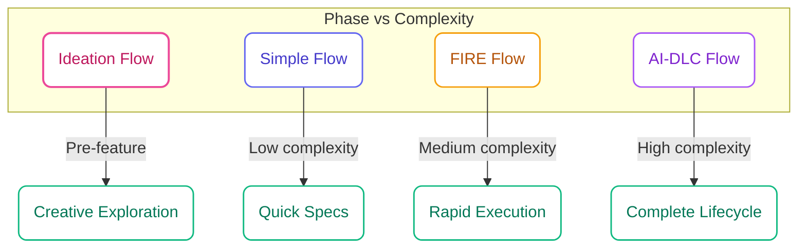

## Four Flows, Every Use Case

specs.md offers four flows, each designed for a different stage and context. Choose the one that matches your current need.

<CardGroup cols={2}>
  <Card title="Ideation Flow" icon="lightbulb" href="/ideation-flow/overview">
    **Creative brainstorming**

    Spark → Flame → Forge. Diverse ideas to polished concept briefs before you commit to building.
  </Card>
  <Card title="Simple Flow" icon="feather" href="/simple-flow/overview">
    **Spec generation only**

    Quick requirements, design, and task documents without execution tracking.
  </Card>
  <Card title="FIRE Flow" icon="bolt" href="/fire-flow/overview">
    **Rapid execution**

    Ship in hours with adaptive checkpoints and first-class brownfield support.
  </Card>
  <Card title="AI-DLC Flow" icon="building" href="/core-concepts/intents">
    **Full methodology**

    Complete lifecycle with DDD, 4 agents, and comprehensive traceability.
  </Card>
</CardGroup>

## Quick Decision Guide

<Steps>
  <Step title="Do you have a clear feature idea yet?">
    - **No, I'm still exploring** → Use **Ideation Flow** (brainstorm → evaluate → shape a concept brief)
    - **Yes, I know what I want to build** → Continue to Step 2
  </Step>
  <Step title="Do you need execution tracking?">
    - **No** → Use **Simple Flow** (spec generation only, like Kiro)
    - **Yes** → Continue to Step 3
  </Step>
  <Step title="Do you want adaptive or fixed ceremony?">
    - **Adaptive** (right-size rigor based on task complexity) → **FIRE Flow**
    - **Fixed** (predictable checkpoints every time) → **AI-DLC Flow**
  </Step>
  <Step title="Do you hate unnecessary friction?">
    - **Yes** (check when necessary, not everything) → **FIRE Flow**
    - **No** (prefer comprehensive documentation always) → **AI-DLC Flow**
  </Step>
</Steps>

## Detailed Comparison

| Aspect | Ideation | Simple | FIRE | AI-DLC |
|--------|----------|--------|------|--------|
| **Optimized For** | Creative exploration | Spec generation, prototypes | Teams who hate friction | Full traceability needs |
| **Output** | Concept briefs | Specs (req/design/tasks) | Working code + walkthroughs | Working code + full artifacts |
| **Execution Planning** | N/A | N/A | Dynamic (recommends next run) | Pre-planned (bolts) |
| **Checkpoints** | 0 (non-blocking) | 3 (phase gates) | Adaptive (complexity + config) | Comprehensive (fixed) |
| **Agents** | 1 | 1 | 3 | 4 |
| **Execution Tracking** | No | No | Yes (runs, walkthroughs) | Yes (bolts, stages) |
| **Design Docs** | Concept briefs | Basic specs | When complexity warrants | Always (DDD integral) |
| **Monorepo Support** | No | No | First-class | Limited |
| **Brownfield Support** | No | Basic | First-class | Alpha |
| **Output Structure** | `.specs-ideation/` | `specs/{feature}/` | `.specs-fire/` | `memory-bank/` |
| **Ceremony Style** | Zero friction | Minimal | Adaptive | Comprehensive |

## When to Use Each Flow

### Ideation Flow

<Info>
  **Choose Ideation when**: You haven't committed to a specific feature yet—or you want to stress-test your current idea against alternatives you haven't considered.
</Info>

- Early-stage product discovery
- Finding novel angles before writing a spec
- Brainstorming sessions (solo or team)
- Evaluating multiple feature directions before committing resources
- When your first idea might not be the best idea

**Output**: `spark-bank.md` (ideas), `flame-report.md` (evaluations), `concept-brief.md` (shaped concepts)

### Simple Flow

<Info>
  **Choose Simple when**: You need quick specs without the overhead of execution tracking.
</Info>

- Building prototypes or MVPs
- Generating specs for handoff to another team
- Small features in established projects
- Solo developers wanting structured documentation
- Projects that don't need AI-assisted execution

**Output**: `requirements.md`, `design.md`, `tasks.md`

### FIRE Flow

<Info>
  **Choose FIRE when**: You want adaptive execution that right-sizes the rigor.
</Info>

FIRE is **Adaptive Spec-Driven Development**—it analyzes work complexity and your config to decide when to ask and when to burn through.

- Teams who hate unnecessary friction
- Brownfield projects with existing code
- Monorepo architectures
- Projects where implementation plan is often enough, but design docs when needed
- Anyone wanting to ship fast without reckless code generation

**Key Features**:
- **Dynamic execution**: No pre-planned runs—Builder scans work items and recommends what to run next
- **Change-friendly**: Requirements changed? Just update specs, next run adapts automatically
- **Adaptive checkpoints**: Based on work complexity + your autonomy preference
- **Walkthrough generation**: AI documents every change for review
- **Hierarchical standards**: Module-specific overrides in monorepos
- **Brownfield-first**: Analyzes your existing structure and respects your patterns

### AI-DLC Flow

<Info>
  **Choose AI-DLC when**: You need full traceability, DDD, and multi-team coordination.
</Info>

- Teams with multiple developers
- Complex domain logic requiring DDD
- Projects needing comprehensive documentation
- Regulated environments requiring audit trails
- Multi-stakeholder initiatives

**Key Features**:
- **Four specialized agents**: Master, Inception, Construction, Operations
- **Domain-Driven Design**: Full DDD stages in Construction
- **Complete traceability**: Every decision documented
- **Mob rituals**: Mob Elaboration, Mob Construction

## Flow Comparison Matrix

## Switching Between Flows

Flows are independent—they're not an upgrade path. Choose based on your project needs:

<Warning>
  **Flows are not progressive**: Simple doesn't upgrade to FIRE, FIRE doesn't upgrade to AI-DLC. Each flow is designed for different use cases. Choose the right flow upfront.
</Warning>

However, you can:
- Use **Simple Flow** to generate initial specs, then implement manually
- Use **FIRE Flow** for rapid feature development within a project
- Use **AI-DLC Flow** for major initiatives requiring full planning

## Getting Started

<CardGroup cols={2}>
  <Card title="Start with Ideation" icon="play" href="/ideation-flow/quick-start">
    Generate ideas and shape a concept brief
  </Card>
  <Card title="Start with Simple" icon="play" href="/simple-flow/quick-start">
    Generate specs in minutes
  </Card>
  <Card title="Start with FIRE" icon="play" href="/fire-flow/quick-start">
    Ship your first feature fast
  </Card>
  <Card title="Start with AI-DLC" icon="play" href="/getting-started/quick-start">
    Full methodology walkthrough
  </Card>
</CardGroup>
