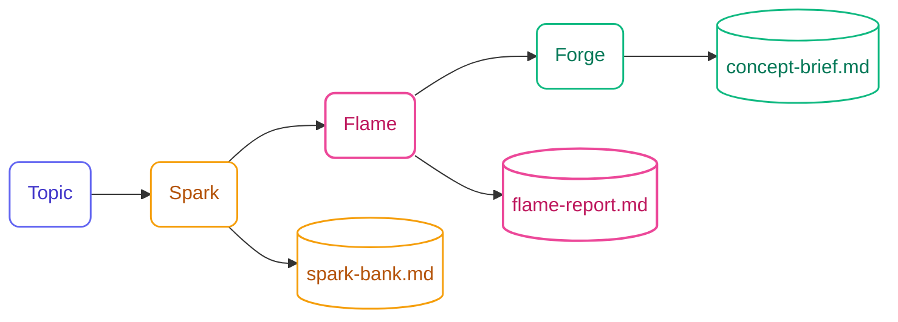

## What is Ideation Flow?

**Ideation Flow** is a research-backed creative brainstorming system that turns AI into a genuine creative partner. Give it a topic and get genuinely diverse ideas in 30 seconds—no setup, no technique selection, no friction.

<Info>
  **Invisible techniques, visible results.** Ideation applies SCAMPER, Six Thinking Hats, the Disney Creative Strategy, and more—you never see the method names, only the output they produce.
</Info>



## Key Differentiators

<CardGroup cols={2}>
  <Card title="Zero Friction" icon="bolt">
    Topic → first 5 ideas in under 30 seconds. No configuration, no setup questions, no technique selection.
  </Card>
  <Card title="Anti-Bias Engine" icon="shuffle">
    12-domain wheel (Technology, Psychology, Business, Nature, Art, Games...) ensures genuine diversity—not AI's usual tech-heavy clustering.
  </Card>
  <Card title="Deep Thinking Per Batch" icon="brain">
    6-step reasoning chain before each idea batch: domain check, raw concepts, novelty filter, cross-pollination, provocation, polish.
  </Card>
  <Card title="Research-Backed Methods" icon="book">
    Synthesizes Osborn-Parnes CPS, de Bono's Six Hats, and Dilts' Disney Strategy. Methods are invisible—you get results, not methodology.
  </Card>
  <Card title="Adaptive Interaction" icon="sliders">
    AI/user ratio shifts by phase: Spark (80% AI), Flame (60% AI), Forge (40% AI). More co-creation as ideas get specific.
  </Card>
  <Card title="Beautiful Output" icon="file-lines">
    Polished Spark Bank, Flame Report, and Concept Brief documents—shareable in a meeting without editing.
  </Card>
</CardGroup>

## Three Skills

### Spark — Generate

Rapid divergent idea generation. AI produces batches of 5 ideas spanning multiple domains, tags each with the technique used (e.g., *via Inversion*), collects your reactions, and adapts.

- **Anti-bias**: min 3 different domains per batch, provocation every 15 ideas
- **Deep thinking**: 6-step reasoning before every batch
- **Output**: `spark-bank.md` grouped by theme with favorites highlighted

### Flame — Evaluate

Multi-perspective convergence using Six Hats. AI runs White/Yellow/Black/Green/Blue analysis per idea, then elicits your gut-feeling (Red Hat). Scores ideas on Impact × Feasibility and produces a shortlist of 3–5.

- **Six Hats**: facts, benefits, risks, alternatives, process, gut-feeling
- **Scoring**: 1–5 Impact × 1–5 Feasibility with 2×2 matrix view
- **Output**: `flame-report.md` with full evaluations, matrix, and shortlist

### Forge — Shape

Concept development using Disney's Creative Strategy (Dreamer → Realist → Critic). Co-build ratio increases per pass so you're deeply involved by the Critic phase.

- **Dreamer pass**: expand vision without limits (80% AI / 20% user)
- **Realist pass**: ground into practical implementation (60% AI / 40% user)
- **Critic pass**: stress-test, surface risks, co-develop mitigations (40% AI / 60% user)
- **Output**: one `concept-brief.md` per shortlisted idea

## When to Use Ideation Flow

<AccordionGroup>
  <Accordion title="You're starting a new feature and want novel angles">
    Before writing specs, run Ideation to explore the space. You might discover an approach you wouldn't have considered—or confirm your first instinct is actually the best one.
  </Accordion>
  <Accordion title="You're stuck in an echo chamber">
    The anti-bias engine deliberately pulls ideas from domains far outside your immediate domain. Nature, Games, Social, and Space perspectives unlock angles that pure tech brainstorming misses.
  </Accordion>
  <Accordion title="You want to run a product discovery session">
    Ideation sessions are resumable and produce polished artifacts. Run Spark with your team, Flame solo, and Forge with a stakeholder—the session state tracks where you left off.
  </Accordion>
  <Accordion title="You need a concept brief for a meeting">
    Forge produces a fully-structured concept brief with vision, implementation plan, and risks. No editing needed before sharing.
  </Accordion>
  <Accordion title="You want to stress-test an idea before committing">
    The Flame phase's Black Hat and Critic pass in Forge surface hidden risks and objections early—before you're invested in implementation.
  </Accordion>
</AccordionGroup>

## Session Structure

Ideation sessions are automatically persisted so you can pause and resume:

```
.specs-ideation/
└── sessions/
    └── {topic-slug}-{YYYYMMDD}/
        ├── session.yaml          # Phase, favorites, scores (resumable)
        ├── spark-bank.md         # All generated ideas, grouped by theme
        ├── flame-report.md       # Six Hats evaluations + shortlist
        └── concept-briefs/
            └── {concept-name}.md # One per shortlisted concept
```

## Get Started

<Steps>
  <Step title="Install specs.md">
    ```bash
    npx specsmd@latest install
    ```
    Select **Ideation** when prompted for flow selection.
  </Step>
  <Step title="Start with a topic">
    ```
    /specsmd-ideation
    ```
    Type your topic or challenge. Ideas appear in under 30 seconds—no questions asked first.
  </Step>
  <Step title="React and iterate in Spark">
    Pick favorites, say "more like #3", "wilder", or "try a business angle". AI adapts each batch.
  </Step>
  <Step title="Evaluate with Flame">
    When you have enough ideas (suggested at ~50), transition to Flame for structured evaluation.
  </Step>
  <Step title="Shape concepts with Forge">
    Develop your top 3–5 ideas into polished Concept Briefs through the Dreamer → Realist → Critic process.
  </Step>
</Steps>

<Card title="Quick Start Guide" icon="rocket" href="/ideation-flow/quick-start">
  Step-by-step walkthrough of a complete ideation session
</Card>
