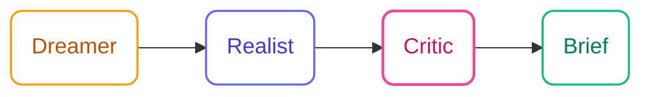

## Prerequisites

- Node.js 18 or higher
- An AI coding tool: Claude Code, Cursor, GitHub Copilot, or Google Antigravity

## Installation

<Steps>
  <Step title="Install specs.md">
    ```bash
    npx specsmd@latest install
    ```
  </Step>
  <Step title="Select Ideation flow">
    When prompted, choose **Ideation - Creative ideation: Spark → Flame → Forge**.
  </Step>
  <Step title="Verify installation">
    ```bash
    ls .specsmd/ideation/agents/
    ```
    You should see the orchestrator agent installed.
  </Step>
</Steps>

## Start a Session

Invoke the orchestrator with a topic, or jump directly to a skill:

<Tabs>
  <Tab title="Claude Code">
    ```
    /specsmd-ideation
    ```
    Type your topic. Example: *"new features for our developer onboarding experience"*
  </Tab>
  <Tab title="Cursor">
    Open Cursor chat and type:
    ```
    /specsmd-ideation
    ```
    Then describe your topic.
  </Tab>
  <Tab title="GitHub Copilot">
    In Copilot chat:
    ```
    @specsmd-ideation
    ```
    Then describe your topic.
  </Tab>
</Tabs>

<Info>
  **Zero friction start**: The orchestrator generates your first 5 ideas immediately—no setup questions. If a session already exists for your topic, it offers to resume where you left off.
</Info>

## Phase 1: Spark

The AI generates batches of 5 ideas spanning multiple domains. Each idea is tagged with the technique that produced it (e.g., *via Inversion*, *via SCAMPER*).

**Example output:**

```
Batch 1 — Developer Onboarding

1. **Contextual Code Sandbox** — Runnable snippets embedded directly in docs, pre-loaded with your team's actual API keys in a safe scope. *via First Principles*
2. **Buddy Bot Assignment** — Auto-pair each new hire with a Slack bot that monitors their questions and surfaces relevant internal docs proactively. *via Analogy*
3. **Anti-Onboarding Audit** — Have the new hire document every blocker they hit in week one; the team uses the list to fix the onboarding. *via Inversion*
4. **Onboarding Sprint** — Compress the full setup experience into a single pair-programming session with a senior engineer. *via Exaggeration*
5. **Experience Replay** — Record senior engineers' first week screens; new hires watch them before they start. *via Time Shift*
```

**How to react:**

| What you say | What happens |
|---|---|
| `"more"` or `"next batch"` | 5 more ideas, different domains |
| `"more like #3"` | Next batch emphasizes that direction |
| `"wilder"` or `"more unconventional"` | Increased provocation in next batch |
| `"more practical"` | Next batch focuses on feasibility |
| `"try a [domain] angle"` | Adds that domain to next batch |
| `"favorite: 1, 3"` | Marks ideas for Spark Bank; carries into Flame |

<Info>
  **When to move on**: The AI suggests transitioning to Flame after ~50 ideas. You can transition earlier with "let's evaluate" or continue generating.
</Info>

**Output artifact**: When you're ready, the AI generates your `spark-bank.md` grouped by theme, with your favorites highlighted.

## Phase 2: Flame

Flame evaluates your ideas through multiple lenses. The AI runs a Six Hats rapid analysis on each idea from your Spark Bank, then asks for your gut feeling.


| Hat | Lens | What it surfaces |
|-----|------|-----------------|
| **White** | Facts | What do we know? What data exists? |
| **Yellow** | Benefits | What's the best case? Why could this work? |
| **Black** | Risks | What could go wrong? What are the obstacles? |
| **Green** | Alternatives | What variations exist? What else could we try? |
| **Blue** | Process | What's the path to implementation? |
| **Red** *(you)* | Gut feeling | Your instinct—no justification needed |

**Red Hat is critical**: The AI explicitly elicits your gut feeling before finalizing the shortlist. Your instinct is a data point.

After the Six Hats analysis, the AI scores each idea on **Impact (1–5)** × **Feasibility (1–5)** and shows a 2×2 matrix. The shortlist (3–5 ideas) is selected from the upper-right quadrant, adjusted by your Red Hat input.

**Output artifact**: `flame-report.md` with full evaluations, scoring matrix, and shortlist with rationale.

## Phase 3: Forge

Forge develops each shortlisted idea into a polished Concept Brief using the Disney Creative Strategy.



| Pass | AI/You | Focus |
|------|--------|-------|
| **Dreamer** | 80% AI / 20% you | Expand the vision without constraints. What's the best possible version? |
| **Realist** | 60% AI / 40% you | Ground it. Tech stack, timeline, team. What does v1 actually look like? |
| **Critic** | 40% AI / 60% you | Stress-test it. What breaks? What are the real risks? Co-develop mitigations. |

The Critic pass is where you're most involved—you know the hidden constraints and organizational context that the AI doesn't.

**Output artifact**: One `concept-brief.md` per idea, containing:
- **Vision** (Dreamer output): Full concept, user value, differentiation
- **Implementation Plan** (Realist output): Phases, tech choices, resource needs
- **Risk Assessment** (Critic output): Risks ranked by severity, mitigations for each

## Resuming a Session

Sessions are automatically saved. If you close and return to an active session:

```
/specsmd-ideation
```

The orchestrator detects the existing session for your topic and offers to resume. All favorites, scores, and progress are preserved.

To start a fresh session on the same topic, say "new session" or use a more specific topic slug.

## Direct Skill Access

Skip the orchestrator and go straight to a skill:

| Command | When to use |
|---------|-------------|
| `/specsmd-spark` | Jump directly to idea generation with a topic |
| `/specsmd-flame` | Evaluate ideas you already have (paste them in or reference a Spark Bank) |
| `/specsmd-forge` | Develop a specific idea into a concept brief directly |

## Command Reference

| Command | Purpose |
|---------|---------|
| `/specsmd-ideation` | Full flow — orchestrator routes based on session state |
| `/specsmd-spark` | Direct idea generation |
| `/specsmd-flame` | Direct idea evaluation |
| `/specsmd-forge` | Direct concept shaping |

## Tips for Success

<AccordionGroup>
  <Accordion title="Be specific with your topic">
    "Mobile app features" produces generic ideas. "Ways to reduce developer onboarding time from 2 weeks to 2 days" produces specific, actionable ones. The more constraint you add, the more surprising the output.
  </Accordion>
  <Accordion title="React to ideas, don't just say 'more'">
    The AI adapts based on your reactions. "More like #3 but applied to the mobile experience" directs the next batch precisely. Vague reactions produce generic follow-ups.
  </Accordion>
  <Accordion title="Don't skip the Red Hat in Flame">
    Gut feeling matters. An idea that scores well on impact/feasibility but gives you a bad feeling is worth examining. The Red Hat makes your instinct an explicit input.
  </Accordion>
  <Accordion title="Let the Critic pass be uncomfortable">
    The Critic phase is designed to surface real problems. Don't try to defend the idea—let the AI find the cracks. That's where the best mitigations come from.
  </Accordion>
  <Accordion title="Use standards for context-aware ideation">
    If your project has standards in `.specs-ideation/standards/`, the orchestrator uses them for context. Tech-specific ideas will align with your actual stack.
  </Accordion>
</AccordionGroup>

## Troubleshooting

<AccordionGroup>
  <Accordion title="Ideas feel too similar or too technical">
    The anti-bias engine enforces domain diversity, but if you're in a STEM-heavy session context it may lean technical. Say "try a social or psychological angle" to explicitly shift. Or "wilder"—the provocation engine kicks in and forces non-obvious directions.
  </Accordion>
  <Accordion title="Session didn't resume from where I left off">
    Check `.specs-ideation/sessions/` for your session folder. If `session.yaml` exists, the orchestrator should detect it. Try: `/specsmd-ideation` and explicitly mention your topic slug.
  </Accordion>
  <Accordion title="Concept brief feels too generic">
    The Forge pass quality scales with your involvement in the Critic phase. Push back, add organizational context, surface hidden constraints. The more specific your input, the more specific the brief.
  </Accordion>
</AccordionGroup>

## Next Steps

<CardGroup cols={2}>
  <Card title="Skills Deep Dive" icon="list-check" href="/ideation-flow/skills">
    Detailed configuration and behavior for Spark, Flame, and Forge
  </Card>
  <Card title="Flow Overview" icon="compass" href="/ideation-flow/overview">
    Architecture, key principles, and when to use Ideation
  </Card>
  <Card title="Compare Flows" icon="arrows-left-right" href="/architecture/choose-flow">
    When to use Ideation vs Simple vs FIRE vs AI-DLC
  </Card>
  <Card title="Installation" icon="download" href="/getting-started/installation">
    Full installation guide for all AI tools
  </Card>
</CardGroup>
