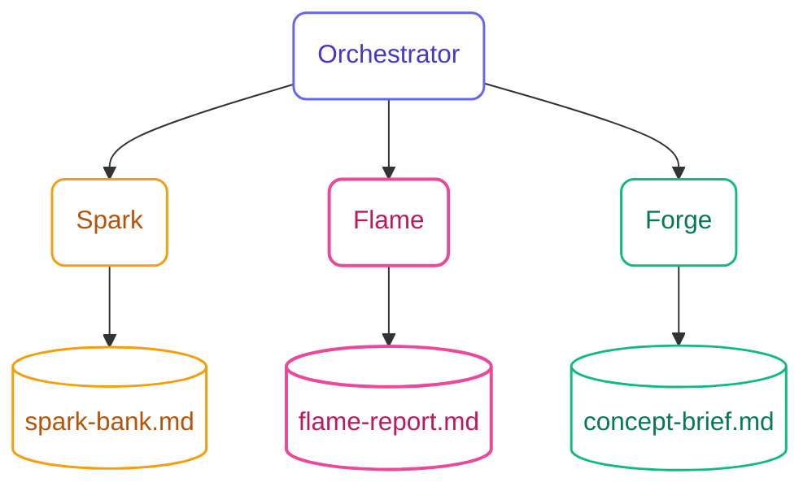
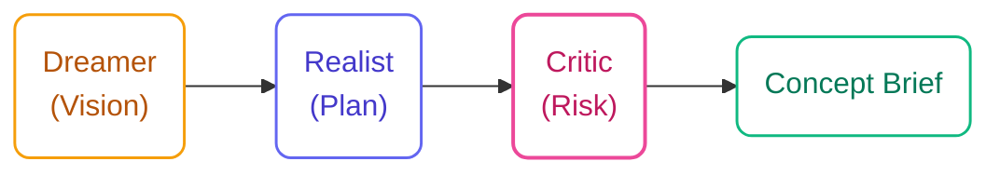

## Three Skills, One Flow

Ideation Flow has a single orchestrator agent that routes between three skills based on session state. Each skill can also be invoked directly.



---

## Spark Skill

**Goal**: Generate genuinely diverse, surprising ideas through rapid batches with maximum divergence.

### How It Works

Before every batch, Spark executes a **6-step deep thinking chain**:

| Step | Name | What Happens |
|------|------|-------------|
| Think 1 | Domain Check | Which domains haven't been used yet this session? |
| Think 2 | Raw Concepts | Generate 10–15 unfiltered raw concepts |
| Think 3 | Novelty Filter | Remove ideas that are obvious or already covered |
| Think 4 | Cross-Pollinate | Combine concepts from different domains |
| Think 5 | Provocation | If due (every 15 ideas), force a deliberate provocation |
| Think 6 | Polish | Refine to 5 ideas with clear technique tags |

<Info>
  **Deep thinking is collapsed by default.** You see the final 5 ideas, not the reasoning chain. Set visibility to `visible` in `memory-bank.yaml` if you want to watch the reasoning.
</Info>

### Anti-Bias Engine

The **12-domain wheel** enforces cognitive diversity across every session:

<CardGroup cols={3}>
  <Card title="Technology / Engineering" icon="microchip" />
  <Card title="Human Psychology / Behavior" icon="brain" />
  <Card title="Business / Economics" icon="chart-line" />
  <Card title="Nature / Biology" icon="leaf" />
  <Card title="Art / Design / Aesthetics" icon="palette" />
  <Card title="Games / Play" icon="gamepad" />
  <Card title="Social / Community" icon="people-group" />
  <Card title="Physical Space / Architecture" icon="building" />
  <Card title="Time / Temporal" icon="clock" />
  <Card title="Extreme / Edge Cases" icon="triangle-exclamation" />
  <Card title="Inversion / Opposite" icon="rotate" />
  <Card title="Random Cross-Pollination" icon="shuffle" />
</CardGroup>

**Diversity rules enforced per batch:**
- Minimum 3 different domains in every batch of 5
- No consecutive ideas from the same domain
- Session-level tracking prevents clustering around familiar themes

**Provocation cadence:**
- Every 15 ideas: a deliberate provocation (Inversion, Exaggeration, Elimination, Time Shift, Stakeholder Swap, or Random)
- Every 20 ideas: a full perspective shift to a distant domain

### Configuration (`memory-bank.yaml`)

```yaml
spark:
  batch_size: 5          # Ideas per batch
  target_count: 50       # Suggested convergence threshold
  max_batches: 20        # Safety limit

anti_bias:
  domain_diversity_min: 3       # Minimum domains per batch
  provocation_frequency: 15     # Provocation every N ideas
  perspective_shift_frequency: 20

deep_thinking:
  prefer_mcp: true              # Use Sequential Thinking MCP if available
  fallback: built-in
  steps_per_batch: 6
  visibility: collapsed         # visible | collapsed | hidden
```

### Spark Bank Output

The Spark Bank is a structured markdown document grouping all ideas by theme, with favorites highlighted:

```
# Spark Bank: Developer Onboarding

## Summary
- Total ideas: 47
- Favorites: 8
- Domains covered: 9/12

## Theme: Friction Reduction
⭐ **Contextual Code Sandbox** — Runnable snippets in docs, pre-loaded with your API keys in a safe scope. *via First Principles*
**Onboarding Sprint** — Full setup compressed into one pair-programming session. *via Exaggeration*

## Theme: Knowledge Transfer
⭐ **Buddy Bot Assignment** — Slack bot that surfaces relevant internal docs as the new hire encounters gaps. *via Analogy*
...
```

---

## Flame Skill

**Goal**: Evaluate ideas fairly through multiple perspectives—surface hidden value, expose real risks, produce a ranked shortlist.

### Six Hats Analysis

For each idea, Flame runs all five objective hats automatically (no interruption), then explicitly elicits the Red Hat from you:

| Hat | Color | Lens |
|-----|-------|------|
| **White** | Facts | What data exists? What don't we know? |
| **Yellow** | Optimism | What's the best case? Why could this succeed? |
| **Black** | Caution | What could fail? What are the real obstacles? |
| **Green** | Creativity | What variations exist? What else could we do? |
| **Blue** | Process | What's the implementation path? What comes first? |
| **Red** *(you)* | Intuition | Your gut feeling — no justification required |

<Info>
  **Red Hat is a deliberate pause.** Before producing the shortlist, Flame asks for your gut reaction on each idea. This captures organizational knowledge, personal context, and instinct that the objective hats can't surface.
</Info>

### Scoring

After the Six Hats analysis, each idea is scored:

| Axis | Scale | What It Measures |
|------|-------|-----------------|
| **Impact** | 1–5 | Potential value if it works |
| **Feasibility** | 1–5 | Realistic chance of execution |

Ideas are plotted on a 2×2 matrix (Impact × Feasibility). The shortlist (3–5 ideas) defaults to the upper-right quadrant, adjusted by your Red Hat input.

### Configuration

```yaml
flame:
  default_method: six-hats-rapid
  shortlist_size: 5
```

### Flame Report Output

```
# Flame Report: Developer Onboarding

## Evaluations

### Contextual Code Sandbox
- **White**: No direct competitor data; internal tooling exists
- **Yellow**: Eliminates "it works on my machine" problem permanently
- **Black**: API key management complexity; security review needed
- **Green**: Could extend to full environment snapshots
- **Blue**: Phase 1: static sandbox → Phase 2: live environment
- **Red** *(your input)*: "Strong gut feel — this is the one"
- **Score**: Impact 5, Feasibility 3

## Scoring Matrix
[2×2 matrix: Impact × Feasibility]

## Shortlist (Top 5)
1. Contextual Code Sandbox (I:5, F:3) ← your Red Hat favorite
2. Buddy Bot Assignment (I:4, F:4)
...
```

---

## Forge Skill

**Goal**: Develop shortlisted ideas into polished, actionable Concept Briefs using the Disney Creative Strategy.

### Disney Creative Strategy

Robert Dilts' model separates three distinct thinking modes that must not mix:



<Warning>
  **Passes must not mix.** The Dreamer phase has no constraints—introducing feasibility concerns here kills creative thinking. The Realist phase grounds the vision—don't critique here. The Critic phase is where stress-testing happens.
</Warning>

### Pass Details

**Dreamer Pass (80% AI / 20% you)**

Expand the vision without limits. What is the best possible version of this idea?
- Full concept description
- User value proposition
- Differentiation angle
- The "dream" experience

**Realist Pass (60% AI / 40% you)**

Ground the vision in reality. What does v1 actually look like?
- Technology choices
- Implementation phases (v1, v2, v3)
- Team and time requirements
- Integration points

**Critic Pass (40% AI / 60% you)**

Stress-test the concept. This is where your organizational context matters most.
- Risks ranked by severity (Critical / High / Medium / Low)
- Mitigations for each risk
- Known organizational constraints
- "What would make this fail?"

<Info>
  **You are most involved in the Critic pass.** The AI surfaces generic risks; you add the real organizational blockers, political constraints, and hidden dependencies that only you know about.
</Info>

### Configuration

```yaml
forge:
  default_method: disney-strategy
  include_pitch: true
  include_risks: true
```

### Concept Brief Output

```markdown
# Concept Brief: Contextual Code Sandbox

## Vision (Dreamer)
A fully-functional development environment embedded in documentation.
New hires run real code against real APIs on day one—no local setup required.
The "first day works" experience becomes the default, not the exception.

## Implementation Plan (Realist)
**Phase 1 (2 weeks)**: Static sandbox with pre-loaded API credentials in isolated scope
**Phase 2 (4 weeks)**: Full environment snapshots tied to specific onboarding paths
**Phase 3 (ongoing)**: Self-updating sandboxes that mirror production changes

Tech: WebContainers (StackBlitz), credential vault integration, Markdown MDX

## Risk Assessment (Critic)
| Risk | Severity | Mitigation |
|------|----------|-----------|
| Security review for credential scoping | Critical | Dedicated security review sprint before Phase 1 |
| Engineering buy-in for maintenance | High | Async RFC + demo with early adopters |
| Browser compatibility for WebContainers | Medium | Fallback to static code blocks with copy button |
```

---

## Session State

All session data is persisted in `session.yaml`:

```yaml
session:
  id: developer-onboarding-20260528
  topic: "Reduce developer onboarding from 2 weeks to 2 days"
  created: 2026-05-28T09:00:00Z
  updated: 2026-05-28T14:30:00Z
  phase: forge

spark:
  batches_generated: 9
  total_ideas: 47
  favorites: [S1-1, S2-3, S4-2, S5-1, S6-4, S7-2, S8-1, S8-5]
  domains_used: [Technology, Psychology, Business, Nature, Games, Social, Space, Inversion]
  domains_remaining: [Art, Time, Extreme, Random]

flame:
  ideas_evaluated: 12
  shortlist: [S1-1, S2-3, S4-2, S5-1, S7-2]
  scoring_method: six-hats-rapid

forge:
  concepts_shaped: 2
  briefs_generated: [contextual-code-sandbox.md, buddy-bot-assignment.md]
```

---

## Interaction Adaptation

The AI adjusts its interaction style based on the current skill phase:

| Phase | Generate | Elicit | Co-Build |
|-------|----------|--------|----------|
| **Spark** | 80% | 5% | 15% |
| **Flame** | 60% | 15% | 25% |
| **Forge** | 40% | 20% | 40% |

**Override signals:**
- `"you decide"` → shifts toward more generation
- `"ask me"` → shifts toward more elicitation

**Hard rule**: Never more than 2 questions before generating output. Flow never stalls.
